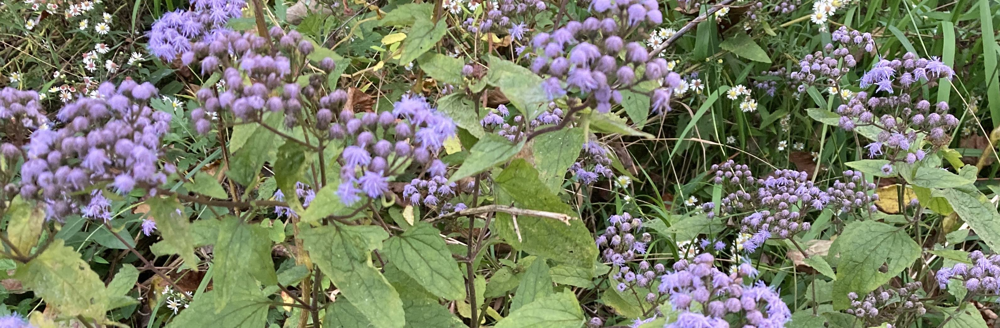

# Bioinformatics Team Governance and Operations Document



### Table of Contents

1. [Introduction](#introduction)
    - [Project Overview and Objectives](#project-overview-and-objectives)
        - [Bioinformatics Analysis](#bioinformatics-analysis)
    - [Our Team](#our-team)
        - [Organizational Structure](#organizational-structure)
2. [Operations](#operations)
    - [Communications](#communications)
    - [Procedures](#procedures)
3. [Community Practices](#community-practices)
    - [Open Science Commitment](#open-science-commitment)
4. [Attribution, Authorship, and Ownership](#attribution-authorship-and-ownership)

## Introduction

This Project Governance document will be used to give an overview of the project structure for sharing data and documents.

### Project Overview and Objectives

The objective of this project is to be able to share code within the team and be able to suggest changes to any analysis code that exists within the repository.

#### Bioinformatics Analysis

Individual analysis scripts will be saved to this repository so that all team members have access to it. The code will be well documented such that it will be feasible for any team member to 
run the code and/or to understand modifications that have been made to the code. 

### Our Team

The team will include researchers that work in the fields of bioinformatics and data science. This will include both research associates as well as graduate and undergraduate students. A faculty member will serve as the PI for the team.

#### Organizational Structure

```
Bioinformatics Team PI
├── Project Group 1
|   ├── Bioinformatics Research Associate*
|   └── Graduate Student
├── Project Group 2
|   ├── Graduate Student*
|   ├── Graduate Student
|   └── Bioinformatics Research Associate
└── Project Group3 
    ├── Database Management Research Associate*
    └── Undergraduate Student

```

## Operations

In order to ensure that project announcements are recieved by all team members, the communication routes (at least initially) are described below.

### Communications

**Internal communications**: communications within the team will take place either in person when possible or via Zoom meetings.

**Note keeping & attendees**: as the team size will initially be fairly small, the team will likely meet in person on a regular schedule. Any meeting scheduling items or notes for topics to be discussed at the meetings will be shared using Google documents. As the team continues to grow, we would probably look at using Slack for team communications.

### Procedures

All of the code required for this project will be maintained within the repository. It is envisioned at the outlook that each team member will have ownership of a specific directory related to a specific type of analysis. 


## Community Practices

### Open Science Commitment 

Any code that is used in generating material for publications will be available so that figures and/or analysis can be reproduced. A separate repository will be used to store this code and it will serve as an open archive. 

## Attribution, Authorship, and Ownership

The code included in this github will be made available under the GNU General Public Licence v3.0: https://www.gnu.org/licenses/gpl-3.0.en.html
